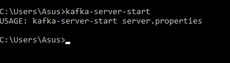
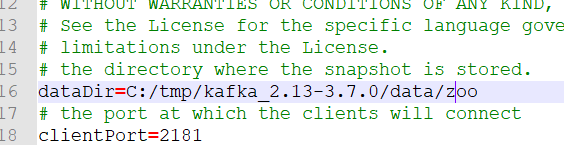
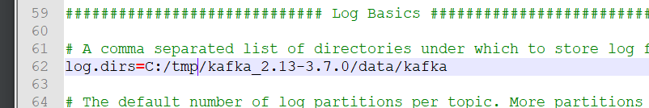
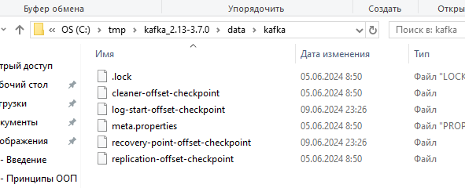
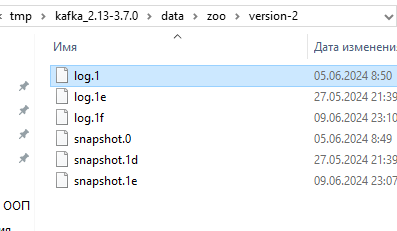
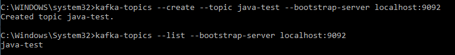
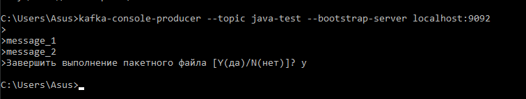
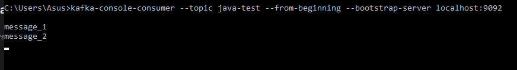

## Planner micro

1) Config (там хранятся необходимые параметры для запуска сервисов, сервис поставляет параметры для других
   сервисов) - [http://localhost:8888/](http://localhost:8888/)
2) Eureka-server (там можно посмотреть зарегистрированные сервисы) - [http://localhost:8761/](http://localhost:8761/)
2) Eureka-client (Planner user) - сервис отвечает за работу с юзерами приложения - http://localhost:x/ (х - рандомный
   порт, который определяется на старте приложения)
3) Eureka-client (Planner task) - сервис отвечает за работу с задачами - http://localhost:x/ (х - рандомный порт,
   который определяется на старте приложения)
4) Api Gateway (настроен роутинг) :  
   Eureka-client - [http://localhost:8765//planner-user](http://localhost:8765//planner-user) - для обращения к сервису
   Planner user   
   Eureka-client(2) - [http://localhost:8765//planner-task](http://localhost:8765//planner-task) - для обращения к
   сервису Planner task

## Запуск Kafka на Windows

Kafka - это броккер сообщений, который позволяет общаться между собой микросервисам.    
Для установки Kafka необходимо выполнить следующее:
1) перейти на сайт [https://kafka.apache.org/quickstart](https://kafka.apache.org/quickstart) и скачать архив 'Download
   Kafka';
2) распоковать его на компьютере;
3) Установить на компьютере новую переменную среды, в моё случае в переменной path необходимо было указать - C:\tmp\kafka_2.13-3.7.0\bin\windows;
4) Для проверки правильности установки Kafka можно в командой строке написать следующу команду - "kafka-server-start" и увидеть следующей результат:  
      
   **Перед тем как запустить сервер Kafka, необходимо создать папки для хранения служебных данных:**
1) создать папку data внутри папки kafka_2.13-3.7.0;
2) внутри паки data создать папку zookeeper; - для того чтобы сервер писал туда данные, необходимо в папке config открыть файл zookeeper.properties и в разделе dataDir указать путь к этой папке   
      
   *обратите внимание на слеш в указании пути, чтобы он нормально отработал, неоходимо будет его поменять как на картинке
3) внутри папки data создать папку kafka. - для того чтобы сервер писал туда данные, необходимо в папке config открыть файл server.properties и в разделе log.dirs указать путь к этой папке   
      
   *обратите внимание на слеш в указании пути, чтобы он нормально отработал, неоходимо будет его поменять как на картинке
# Запуск сервер Kafka:
**Для запуска сервера необходимо использовать Zookeeper, открыть несколько командных строк и в каждой из них выполнить следующие команды:**
1) Запускаем Zookeeper сервис в командной строке - zookeeper-server-start.bat C:\tmp\kafka_2.13-3.7.0\config\zookeeper.properties , где C:\tmp\kafka_2.13-3.7.0\config\zookeeper.properties является путём до конфига Zookeeper;
2) Запускаем Kafka сервис. Для этого необходимо открыть новую командную строку и написать следующую команду - kafka-server-start C:\tmp\kafka_2.13-3.7.0\config\server.properties;   
   После запуска двух серверов необходимо проверить что они пишут логи в наши папки:   
      
   Если логи создались, значит всё ок и всё работает!
# Создание Topic из консоли
Топик - это своеобразная труба, в которую можно отправлять сообщения и любые слушатели этого топика могут считывать эти сообщения.   
Необходимо отрыть командуную строку и написать следующую команду - kafka-topics --create --topic java-test --bootstrap-server localhost:9092, где 'java-test' - это название топика   
Для того, чтобы посмотреть все топики, то можно ввести следующую команду - kafka-topics --list --bootstrap-server localhost:9092   
   
# Отправка сообщения в topic из консоли
Для отправки сообщения в топик из консоли необходимо в командной строке ввести следующую команду - kafka-console-producer --topic java-test --bootstrap-server localhost:9092, где java-test - это название топика. Для выхода необходимо нажать ctr + c.   
   
# Считывание сообщения из консоли   
Для того, чтобы считать сообщения с топика, необходимо выполнить следующую команду в командной строке - kafka-console-consumer --topic java-test --from-beginning --bootstrap-server localhost:9092, где java-test - это название топика, а --from-beginning - отвечает за то, что при выполнении этой команды покажет все сообщения после его создания, а если не укказать, то только свежие.   


## Подключение Kafka к проекту
# Добалвение зависимостей
Для того, чтобы можно было использовать Kafka, необходимо подключить зависимость к проекту в pom.xml

```xml
        <dependency>
            <groupId>org.springframework.kafka</groupId>
            <artifactId>spring-kafka</artifactId>
        </dependency>
```
 
Поле добавление зависимости, необходимо прописать настройка в properties
```properties
spring.kafka.consumer.bootstrap-servers: localhost:9092
spring.kafka.consumer.group-id: jd
spring.kafka.consumer.key-deserializer: org.apache.kafka.common.serialization.StringDeserializer
spring.kafka.consumer.value-deserializer: org.springframework.kafka.support.serializer.JsonDeserializer

spring.kafka.producer.bootstrap-servers: localhost:9092
spring.kafka.producer.key-serializer: org.apache.kafka.common.serialization.StringSerializer
spring.kafka.producer.value-serializer: org.springframework.kafka.support.serializer.JsonSerializer
```

## KeyCloak
Существуют основные термины:   
**Идентификация** – сообщаете кто вы (или кем хотите являться). Часто этот пункт пропускают и говорят только о следующих двух.   
**Аутентификация** – подтверждение своей идентификации (логин-пароль, сертификат)   
**Авторизация** – какие у вас права (что вы имеете право выполнять в системе)   
KeyCloak позволяет настроить security вашего приложения. Он берёт на себя задачу по аутентификации и Авторизации юзера, бизнес-приложение будет общаться с полученным ключом доступа в KeyCloak для получения ответа, можно ли давать пользователю доступ к ресурсам или нет.
# Установка KeyCloak


   


