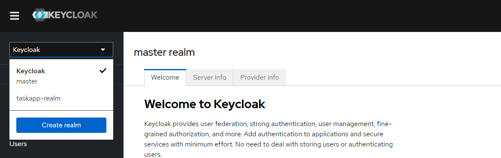

## Planner micro

1) Config (там хранятся необходимые параметры для запуска сервисов, сервис поставляет параметры для других
   сервисов) - [http://localhost:8888/](http://localhost:8888/)
2) Eureka-server (там можно посмотреть зарегистрированные сервисы) - [http://localhost:8761/](http://localhost:8761/)
2) Eureka-client (Planner user) - сервис отвечает за работу с юзерами приложения - http://localhost:x/ (х - рандомный
   порт, который определяется на старте приложения)
3) Eureka-client (Planner task) - сервис отвечает за работу с задачами - http://localhost:x/ (х - рандомный порт,
   который определяется на старте приложения)
4) Api Gateway (настроен роутинг) :  
   Eureka-client - [http://localhost:8765//planner-user](http://localhost:8765//planner-user) - для обращения к сервису
   Planner user   
   Eureka-client(2) - [http://localhost:8765//planner-task](http://localhost:8765//planner-task) - для обращения к
   сервису Planner task

## Запуск Kafka на Windows

Kafka - это броккер сообщений, который позволяет общаться между собой микросервисам.    
Для установки Kafka необходимо выполнить следующее:
1) перейти на сайт [https://kafka.apache.org/quickstart](https://kafka.apache.org/quickstart) и скачать архив 'Download
   Kafka';
2) распоковать его на компьютере;
3) Установить на компьютере новую переменную среды, в моё случае в переменной path необходимо было указать - C:\tmp\kafka_2.13-3.7.0\bin\windows;
4) Для проверки правильности установки Kafka можно в командой строке написать следующу команду - "kafka-server-start" и увидеть следующей результат:  
      
   **Перед тем как запустить сервер Kafka, необходимо создать папки для хранения служебных данных:**
1) создать папку data внутри папки kafka_2.13-3.7.0;
2) внутри паки data создать папку zookeeper; - для того чтобы сервер писал туда данные, необходимо в папке config открыть файл zookeeper.properties и в разделе dataDir указать путь к этой папке   
      
   *обратите внимание на слеш в указании пути, чтобы он нормально отработал, неоходимо будет его поменять как на картинке
3) внутри папки data создать папку kafka. - для того чтобы сервер писал туда данные, необходимо в папке config открыть файл server.properties и в разделе log.dirs указать путь к этой папке   
      
   *обратите внимание на слеш в указании пути, чтобы он нормально отработал, неоходимо будет его поменять как на картинке
# Запуск сервер Kafka:
**Для запуска сервера необходимо использовать Zookeeper, открыть несколько командных строк и в каждой из них выполнить следующие команды:**
1) Запускаем Zookeeper сервис в командной строке - zookeeper-server-start.bat C:\tmp\kafka_2.13-3.7.0\config\zookeeper.properties , где C:\tmp\kafka_2.13-3.7.0\config\zookeeper.properties является путём до конфига Zookeeper;
2) Запускаем Kafka сервис. Для этого необходимо открыть новую командную строку и написать следующую команду - kafka-server-start C:\tmp\kafka_2.13-3.7.0\config\server.properties;   
   После запуска двух серверов необходимо проверить что они пишут логи в наши папки:   
      
   Если логи создались, значит всё ок и всё работает!
# Создание Topic из консоли
Топик - это своеобразная труба, в которую можно отправлять сообщения и любые слушатели этого топика могут считывать эти сообщения.   
Необходимо отрыть командуную строку и написать следующую команду - kafka-topics --create --topic java-test --bootstrap-server localhost:9092, где 'java-test' - это название топика   
Для того, чтобы посмотреть все топики, то можно ввести следующую команду - kafka-topics --list --bootstrap-server localhost:9092   
   
# Отправка сообщения в topic из консоли
Для отправки сообщения в топик из консоли необходимо в командной строке ввести следующую команду - kafka-console-producer --topic java-test --bootstrap-server localhost:9092, где java-test - это название топика. Для выхода необходимо нажать ctr + c.   
   
# Считывание сообщения из консоли   
Для того, чтобы считать сообщения с топика, необходимо выполнить следующую команду в командной строке - kafka-console-consumer --topic java-test --from-beginning --bootstrap-server localhost:9092, где java-test - это название топика, а --from-beginning - отвечает за то, что при выполнении этой команды покажет все сообщения после его создания, а если не укказать, то только свежие.   


## Подключение Kafka к проекту
# Добалвение зависимостей
Для того, чтобы можно было использовать Kafka, необходимо подключить зависимость к проекту в pom.xml

```xml
        <dependency>
            <groupId>org.springframework.kafka</groupId>
            <artifactId>spring-kafka</artifactId>
        </dependency>
```
 
Поле добавление зависимости, необходимо прописать настройка в properties
```properties
spring.kafka.consumer.bootstrap-servers: localhost:9092
spring.kafka.consumer.group-id: jd
spring.kafka.consumer.key-deserializer: org.apache.kafka.common.serialization.StringDeserializer
spring.kafka.consumer.value-deserializer: org.springframework.kafka.support.serializer.JsonDeserializer

spring.kafka.producer.bootstrap-servers: localhost:9092
spring.kafka.producer.key-serializer: org.apache.kafka.common.serialization.StringSerializer
spring.kafka.producer.value-serializer: org.springframework.kafka.support.serializer.JsonSerializer
```

## KeyCloak
Существуют основные термины:   
**Идентификация** – сообщаете кто вы (или кем хотите являться). Часто этот пункт пропускают и говорят только о следующих двух.   
**Аутентификация** – подтверждение своей идентификации (логин-пароль, сертификат)   
**Авторизация** – какие у вас права (что вы имеете право выполнять в системе)   
KeyCloak позволяет настроить security вашего приложения. Он берёт на себя задачу по аутентификации и Авторизации юзера, бизнес-приложение будет общаться с полученным ключом доступа в KeyCloak для получения ответа, можно ли давать пользователю доступ к ресурсам или нет.     
[Документация](https://www.keycloak.org/docs/latest/server_admin/)

KeyCloak внутри себя поднимает свою базу данных, в которой хранит логины и пароли пользователей, а так же их роли. Для *production* желательно подключить полноценную БД, как описано в документации - [документация](https://www.keycloak.org/server/db)

    
 
# Установка KeyCloak (Windows)
1) Переходим на офф сайт [KeyCloak](https://www.keycloak.org/downloads/) и скачиваем.
Под Windows можно скачать zip архив и извлечь его в папку.   
2) Переходим в переменные среды и добавляем в переменную path новый url - *пример C:\Program Files\keycloak-24.0.5\bin*
3) (Если у вас не установлена переменная JAVA_HOME, то её нужно будет установить)   

# Запуск KeyCloak   
Для того чтобы запустить KeyCloak нужно открыть командную строку от имини администратора и запустить следующую команду - *kc.bat start-dev*   
   

По дефолту KeyCloak запускается на порте 8080, что будет мешать нашим другим серверам запускаться. В момент запуска KeyCloak можно поменять порт, на котором будет приложение разворачиваться,
нужно выполнять следующую команду - *kc.bat start-dev --http-port=8180* , где 8180 - порт на котором приложение будет разворачиваться.   
Любые другие изменения, которые можно реализовать в KeyCloak описаны [тут](https://www.keycloak.org/server/all-config)   
Для проверки какие порты у вас на компьютере заняты, можно ввести следуюущую команду в командной строке - *netstat -aon* в графе "локальный адрес" взять последние цифры и диспечере задач в разделе "подробнее" сранить их с числами ИД, тем самым можножно посмотреть какие приложения заниманиют какие порты.   
После запуска сервера, можно попробовать перейти на его страцицу и пройти регистрацию админа [тут](http://localhost:8180/)   
   

# Создание Realm   
Realm - рабочая область со всем данными и пользователями, у каждого приложения должен быть свой realm.   Для работы и тестирования KeyCloak необходимо создать свой realm
   
Указываете Realm name и создаёте(главное перед началом работы не забывайте переключаться на нужный realm)    

# Создание Client    
Client – это ваше приложение Resource Server (backend-приложение), которое будет использовать Auth Server для валидации access token и других действий OAuth2, к которому пользователь захочет получить доступ.    
    
Указывайте ClientId любой, так же необходимо указать redirect url, на который Keycloak будет перенаправлять в случаее удачно авторизации.    

# Grant Types (flow)    
Grant Type – способ получения и хранения access token. Существует несколько типов grant type:
* Authorization Code
* PKCE
* Client Credentials
* Device Code
* Refresh Token (не очень подходит, т.к. используется для обновление токена)   

А также есть ещё Legacy Grant Type:
* Implicit Flow
* Password Grant

# Authorizarion Code (AC)   
Authorizarion Code можно использовать для классических веб приложений, потому что код frontend формируется на сервере и код никуда не передается. Все хранится на сервере (а значит сервер может хранить безопасно любые секретные данные, например в файле настроек).
# Схема работы Authorizarion Code
   
## Глобальные шаги:   

* Переходим на ресурс
* Вводим логин-пароль
* Получаем специальный authorization code (AC)
* Обмениваем AC на access token (AT)
* Записываем AT в запрос
* Получаем данные c Resource Server с помощью AT

## Настройка Authorizarion Code в KeyCloak

1) В разделе Clients создаём client, указываем Client type - OpenID Connect, Client ID и name;
2) Выбираем следующие параметры   
3) 
4) Указываем Valid redirect URIs (на какие url можно будет осуществлять redirect);

   Выполняется не в Postman, а в браузере.
```url
http://localhost:8180/realms/taskapp-realm/protocol/openid-connect/auth?response_type=code&client_id=taskapp-client&state=safdasfdsf3232&scope=openid profile&redirect_uri=http://localhost:8080/redirect
```

Post запрос позволяет получить access token(Запрос можно выполнить в Postman) 
```url
http://localhost:8180/realms/taskapp-realm/protocol/openid-connect/token
```
Параметры в Body:
grant_type : authorization_code   
client_id : taskapp-client (название вашего client)   
client_secret : xxx (Берём из KeyCloak в разделе Credentials)   
code : xxx (Берём из ранее полученного ответа)   
redirect_uri : http://localhost:8080/redirect (Берём из KeyCloak)   
В результате получаем что-то типо такого 
```json
{
    "access_token": "eyJhbGciOiJSUzI1NiIsInR5cCIgOiAiSldUIiwia2lkIiA6ICJjdTIxUl9ydDh4RURUOWNmbkJlaXlBcTNKOWNhWm01N2ZJNFdhMnlVcHNRIn0.eyJleHAiOjE3MTkxMjYxNzksImlhdCI6MTcxOTEyNTg3OSwiYXV0aF90aW1lIjoxNzE5MTI1NjIzLCJqdGkiOiJmMTg5NDczMy0xYzRhLTRiYjUtOTIzNy1hNzA4Njk1M2Y1YTAiLCJpc3MiOiJodHRwOi8vbG9jYWxob3N0OjgxODAvcmVhbG1zL3Rhc2thcHAtcmVhbG0iLCJhdWQiOiJhY2NvdW50Iiwic3ViIjoiOTZmMzM3MGMtMTNlNi00MTRjLThjZDAtMTM3OGE0OWI5ZDllIiwidHlwIjoiQmVhcmVyIiwiYXpwIjoidGFza2FwcC1jbGllbnQiLCJzZXNzaW9uX3N0YXRlIjoiYTQ1NGNlNTctZjc0NC00YjI3LTkwNWUtMTRkMTc4YzJlODE3IiwiYWNyIjoiMCIsImFsbG93ZWQtb3JpZ2lucyI6WyIvKiJdLCJyZWFsbV9hY2Nlc3MiOnsicm9sZXMiOlsiZGVmYXVsdC1yb2xlcy10YXNrYXBwLXJlYWxtIiwib2ZmbGluZV9hY2Nlc3MiLCJ1bWFfYXV0aG9yaXphdGlvbiJdfSwicmVzb3VyY2VfYWNjZXNzIjp7ImFjY291bnQiOnsicm9sZXMiOlsibWFuYWdlLWFjY291bnQiLCJtYW5hZ2UtYWNjb3VudC1saW5rcyIsInZpZXctcHJvZmlsZSJdfX0sInNjb3BlIjoib3BlbmlkIGVtYWlsIHByb2ZpbGUiLCJzaWQiOiJhNDU0Y2U1Ny1mNzQ0LTRiMjctOTA1ZS0xNGQxNzhjMmU4MTciLCJlbWFpbF92ZXJpZmllZCI6ZmFsc2UsIm5hbWUiOiJ1c2VyIHVzZXIiLCJwcmVmZXJyZWRfdXNlcm5hbWUiOiJ1c2VyIiwiZ2l2ZW5fbmFtZSI6InVzZXIiLCJmYW1pbHlfbmFtZSI6InVzZXIiLCJlbWFpbCI6InVzZXJAZ21haWwuY29tIn0.xOXJ05Zh3biwkLfbeD_P5BZ-kXmuVLUxhDwToDOGxSYlyXuY3a3-EQMD5faWgZCwCzDJbGOdt0hr2V_X40NEsFgLfTOs3FzXG3kGv8ZfGVqd1KAmPanLwDuZ9AbA_SfNsiwNrkz6bbIThlBpbRTZmxYMm_1X1fnDzmOmg4s4ViS0cs1sDV1NMwfGUWWvP0bsQr2mLnKDG5mP4ZSZqHSsF74Tx34PsQfKOMHa4QiCeyRDpX8Co_wjubkm8lYFuzfnoDXWfb3i0gQ9TkvZ_2Kacu6PW9OxGBvtXN0mDiOsKRs9B_CITbxLzhFl-KhB53yxUxLhTljtDejD71t3HPNSMQ",
    "expires_in": 300,
    "refresh_expires_in": 1800,
    "refresh_token": "eyJhbGciOiJIUzUxMiIsInR5cCIgOiAiSldUIiwia2lkIiA6ICJiODZiM2E0Mi05ZGQwLTQ3Y2UtYThmMi1mYzhkZDdkOGI3ZTUifQ.eyJleHAiOjE3MTkxMjc2NzksImlhdCI6MTcxOTEyNTg3OSwianRpIjoiZmZhNzEyYjYtNDY1NC00YTc1LWE5OGQtODFjZDFlN2JlYWQ5IiwiaXNzIjoiaHR0cDovL2xvY2FsaG9zdDo4MTgwL3JlYWxtcy90YXNrYXBwLXJlYWxtIiwiYXVkIjoiaHR0cDovL2xvY2FsaG9zdDo4MTgwL3JlYWxtcy90YXNrYXBwLXJlYWxtIiwic3ViIjoiOTZmMzM3MGMtMTNlNi00MTRjLThjZDAtMTM3OGE0OWI5ZDllIiwidHlwIjoiUmVmcmVzaCIsImF6cCI6InRhc2thcHAtY2xpZW50Iiwic2Vzc2lvbl9zdGF0ZSI6ImE0NTRjZTU3LWY3NDQtNGIyNy05MDVlLTE0ZDE3OGMyZTgxNyIsInNjb3BlIjoib3BlbmlkIGVtYWlsIHByb2ZpbGUiLCJzaWQiOiJhNDU0Y2U1Ny1mNzQ0LTRiMjctOTA1ZS0xNGQxNzhjMmU4MTcifQ.oPdAbXWd2jojvd3hLBM_uC6Dgr9GeylQy2gu14l9pFR4nPu8AkPJT5BW5tPPqMchKG-qMnMoa13V4Pl8ujZRHA",
    "token_type": "Bearer",
    "id_token": "eyJhbGciOiJSUzI1NiIsInR5cCIgOiAiSldUIiwia2lkIiA6ICJjdTIxUl9ydDh4RURUOWNmbkJlaXlBcTNKOWNhWm01N2ZJNFdhMnlVcHNRIn0.eyJleHAiOjE3MTkxMjYxNzksImlhdCI6MTcxOTEyNTg3OSwiYXV0aF90aW1lIjoxNzE5MTI1NjIzLCJqdGkiOiJhZDY1ZWNiZi1jMzkxLTQyM2EtYTY5ZS1kM2I2ZTBiMTQyMjUiLCJpc3MiOiJodHRwOi8vbG9jYWxob3N0OjgxODAvcmVhbG1zL3Rhc2thcHAtcmVhbG0iLCJhdWQiOiJ0YXNrYXBwLWNsaWVudCIsInN1YiI6Ijk2ZjMzNzBjLTEzZTYtNDE0Yy04Y2QwLTEzNzhhNDliOWQ5ZSIsInR5cCI6IklEIiwiYXpwIjoidGFza2FwcC1jbGllbnQiLCJzZXNzaW9uX3N0YXRlIjoiYTQ1NGNlNTctZjc0NC00YjI3LTkwNWUtMTRkMTc4YzJlODE3IiwiYXRfaGFzaCI6ImZVZnNwS2N6MU50WWlOenhvenVRc1EiLCJhY3IiOiIwIiwic2lkIjoiYTQ1NGNlNTctZjc0NC00YjI3LTkwNWUtMTRkMTc4YzJlODE3IiwiZW1haWxfdmVyaWZpZWQiOmZhbHNlLCJuYW1lIjoidXNlciB1c2VyIiwicHJlZmVycmVkX3VzZXJuYW1lIjoidXNlciIsImdpdmVuX25hbWUiOiJ1c2VyIiwiZmFtaWx5X25hbWUiOiJ1c2VyIiwiZW1haWwiOiJ1c2VyQGdtYWlsLmNvbSJ9.QEQWuVA_PZao4HenvwEfyhENFUOQsvvvDG8kjxmToVU86jkIlKHsSYYB5uGvlWN7xonaag-cxEQepl5Zl4yV4PNMEi2eg9df1428Q3ICsGYmXTaeg4_3FhmV6GO4z8ck536H7k3M7R1BTj3jz2kstRAXeX5wJffMS39u_9fenR1rbzS4Ux6dXbPRCKD2exEYB4tq_f8m5hjxigf5Fr4EZPyxc0yJnLqsxGsuQAKAmR5Kk2zvj3ThFKYa9mhk05yrW_CVO-QhMNCdG3B8LLjuIRrHDqUAO05zHzJRuNyIn69oNXmIPgTDa6hcKjudc80ob3v7KkmkbIPfp0RPYuQN7g",
    "not-before-policy": 0,
    "session_state": "a454ce57-f744-4b27-905e-14d178c2e817",
    "scope": "openid email profile"
}
```
Где access_token есть как раз токен авторизации.

# Proof Key for Code Exchange (PKCE)
Такой Grand type подходит для приложения с отдельным фронтом (Single page application), т.к. client application (фронт) не может хранить в себе secret из KeyCloak
   
Для использования этого PKCE flow – нужно сделать следующее   
   
, чтобы НЕ нужно было использовать secret для получения access token.    
*Code verifier* - это код, который создаётя на клиенте (на фронте)
*Code challenge* - передаётся в запросе     
```url
http://localhost:8180/realms/taskapp-realm/protocol/openid-connect/auth?response_type=code&client_id=taskapp-client-pkce&state=safdasfdsf3232&scope=openid profile&redirect_uri=https://localhost:8080/redirect&code challenge=jSnDo9Mn3e_9Oon-DyRceeewLwXTitg8_IBkTkYTn8s&code challenge method=s256
```
Параметры в запросе:
response_type : code   
client_id : taskapp-client-pkce (название вашего client)   
state : safdasfdsf3232 (пока любые символы)   
scope : openid profile (Тип протокола)   
redirect_uri : https://localhost:8080/redirect (Берём из KeyCloak, допустимый Url для редиректа)    
code challenge : jSnDo9Mn3e_9Oon-DyRceeewLwXTitg8_IBkTkYTn8s (можем взять значение из онлайнг генератора (https://tonyxu-io.github.io/pkce-generator/) )    
code challenge method : s256 (алгоритм шифрования)    
В ответ мы получаем следующий url
````url
https://localhost:8080/redirect?state=safdasfdsf3232&session_state=a98d04d3-3de8-4fea-b69e-3f702c763f10&iss=http%3A%2F%2Flocalhost%3A8180%2Frealms%2Ftaskapp-realm&code=e00742d7-db37-4375-83f4-2748e2db9751.a98d04d3-3de8-4fea-b69e-3f702c763f10.46ff80a6-8242-4d3c-a33b-ef7e99e13af9
````
где code=e00742d7-db37-4375-83f4-2748e2db9751.a98d04d3-3de8-4fea-b69e-3f702c763f10.46ff80a6-8242-4d3c-a33b-ef7e99e13af9 - необходимый нам code.